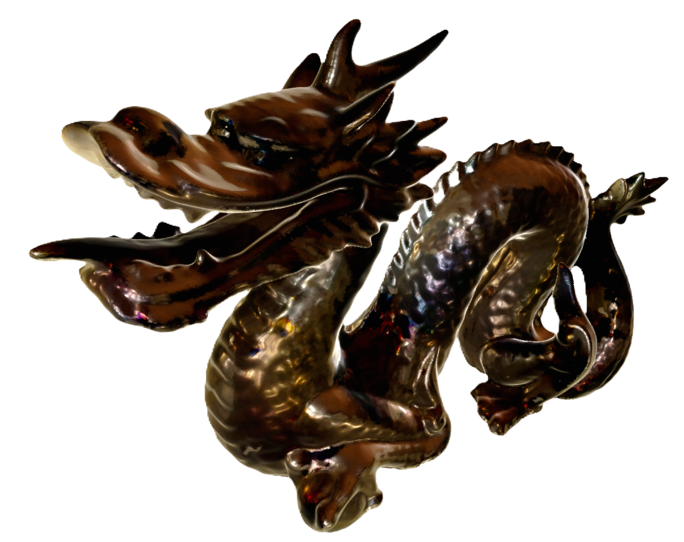

# Multi-View Point Cloud Registration and Reconstruction for High-Fidelity Object Modeling

The purpose of this repository is to establish a high-fidelity 3D reconstruction system based on multi-frame point cloud registration. The point cloud data is derived from various viewpoints around the target object, acquired through scanning. The data sources can be depth cameras or LiDAR (Light Detection and Ranging). 

## Paper

The article is currently undergoing peer review:

## Reconstruction results

- Results on simulated data (rendering by Open3D):

  | dragon                                                       | deer                                                         | vase                                                         |
  | ------------------------------------------------------------ | ------------------------------------------------------------ | ------------------------------------------------------------ |
  |  |  |  |

  

- Results on real-world data:

| Statue                                                       | Sofa                                                         |
| ------------------------------------------------------------ | ------------------------------------------------------------ |
|  |  |

## Requirements

- Eigen3(3.3.4)
- OpenCV (>4.0)
- Open3D
-  [Teaser-pp](https://github.com/MIT-SPARK/TEASER-plusplus) 

## Preparation 

- Install a feature point-based registration algorithm according to  [Teaser-pp](https://github.com/MIT-SPARK/TEASER-plusplus) 's guidance, to serve as the initial registration pose for our algorithm.

- Download data from [GoogleDrive](https://drive.google.com/drive/folders/1zLcwRlwguh5txwxgK075HkXIG-hlaE5V?usp=sharing) and place it in the `data` folder.

- build project:

  ` mkdir build && cd build `

  `cmake .. && make`

 

## Usage

1. Firstly, use [Teaser-pp](https://github.com/MIT-SPARK/TEASER-plusplus) to generate the initial pose, which is based on a feature point matching method, allowing for a rough alignment of the point cloud sequence.

   `./teaser_coarse_align ../cfg/simrecon_params.yaml`

2. Start pairwise and global registration.

   `./multi_way_align_sim ../cfg/simrecon_params.yaml `

## Simulation and Real-world Datasets

All dataset can be downloded at [GoogleDrive](https://drive.google.com/drive/folders/1zLcwRlwguh5txwxgK075HkXIG-hlaE5V?usp=sharing)  

The real-world data is automatically acquired through the omnidirectional collection platform we designed:

Simulation data is collected using a Kinect camera in the Gazebo platform:

## Note.

### The code for the Gazebo simulation data platform, along with more details of our method, will be published subsequently.
